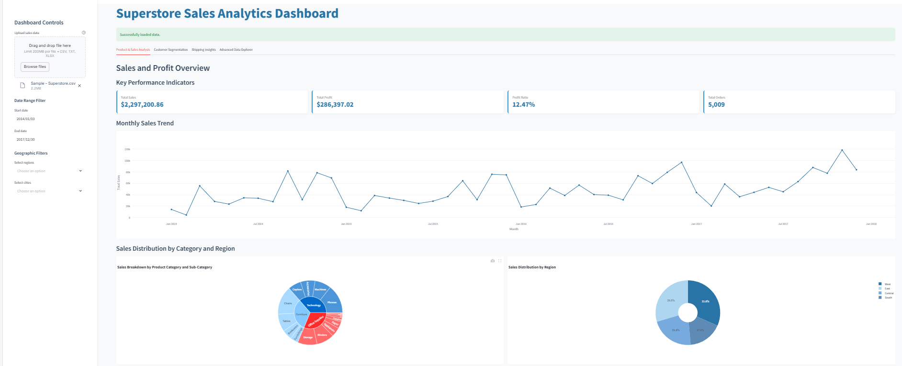

# Brainwave_Matrix_Intern
Superstore Sales Analytics Dashboard built with Streamlit and Plotly.

# 📊 Superstore Sales Analytics Dashboard

This project is part of my internship at **Brainwave Matrix Solutions Pvt Ltd**.

## 🧠 Overview
An interactive sales analytics dashboard built with **Streamlit**, **Pandas**, and **Plotly**.  
It helps explore customer behavior, product performance, shipping efficiency, and much more.

## 🚀 Features
- KPIs: Total Sales, Profit, Profit Ratio, Orders
- Sales Trends and Heatmaps
- Customer Segmentation using RFM
- Shipping Duration Analysis
- Advanced Data Explorer with filters and download options

## 📁 Files Included
- `main.py`: Main Streamlit app
- `Superstore Sales Analytics Dashboard.pdf`: Project report
- `README.md`: This description

## 📷 Preview
- 

## ▶️ How to Run
Make sure you have Python installed, then:
```bash
pip install streamlit pandas plotly openpyxl
streamlit run main.py
